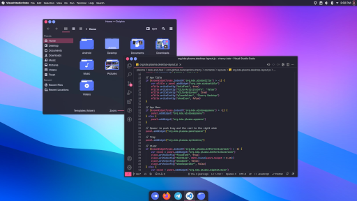

## Cherry KDE
Yet-another Minimal flat theme for KDE Plasma desktop



This theme consist of several components including :
* aurorae theme
* konsole colorscheme
* kvantum theme
* plasma colorscheme
* plasma desktop theme
* splash screen

## Installation

```bash
$ cd cherry-kde-theme
$ ./install.sh
```

This theme uses [**Kvantum engine**](https://github.com/tsujan/Kvantum) for it's Application style.

So in order to completely apply this theme, you have to open **Kvantum Manager** (command : `kvantummanager`), and then select **cherry** on **Change/Delete Theme** section.

## License

This theme is based on Layan-KDE theme by [Vinceliuice](https://github.com/vinceliuice).
And licensed under [GNU GPL v3](LICENSE).
